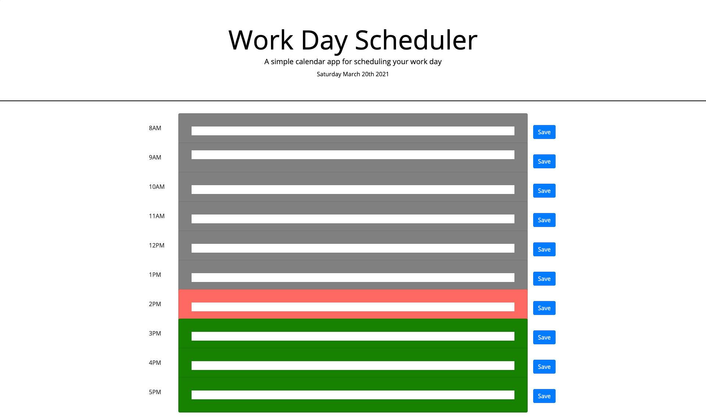

# Day Planner

For this assignment I was tasked with creating a daily scheduling tool for standard business hours. The current Date is displayed at the top. Time blocks are color coded to indicate whether an hours is in the past, present, or future. Once the "save" button is clicked, data is stored locally and persists on page refresh.  

## I practiced the following:
1. Array iteration with forEach()
2. Targeting events for multiple elements using event.target
3. Additional practice storing and getting data from local storage
4. Day/Time formatting using Momentjs

## Screenshots

### Live Site:
#### [Day Planner](https://sranson.github.io/day-planner/)

### Known Issues
1. Text input disappears after page refresh if local storage data is present

### Future Enhancements
1. Add ability to update data after page refresh
2. Improve styling of text inputs
3. Add icons to replace "save" buttons

## License
Permission is hereby granted, free of charge, to any person obtaining a copy of this software and associated documentation files (the "Software"), to deal in the Software without restriction, including without limitation the rights to use, copy, modify, merge, publish, distribute, sublicense, and/or sell copies of the Software, and to permit persons to whom the Software is furnished to do so, subject to the following conditions:

The above copyright notice and this permission notice shall be included in all copies or substantial portions of the Software.

THE SOFTWARE IS PROVIDED "AS IS", WITHOUT WARRANTY OF ANY KIND, EXPRESS OR IMPLIED, INCLUDING BUT NOT LIMITED TO THE WARRANTIES OF MERCHANTABILITY, FITNESS FOR A PARTICULAR PURPOSE AND NONINFRINGEMENT. IN NO EVENT SHALL THE AUTHORS OR COPYRIGHT HOLDERS BE LIABLE FOR ANY CLAIM, DAMAGES OR OTHER LIABILITY, WHETHER IN AN ACTION OF CONTRACT, TORT OR OTHERWISE, ARISING FROM, OUT OF OR IN CONNECTION WITH THE SOFTWARE OR THE USE OR OTHER DEALINGS IN THE SOFTWARE.